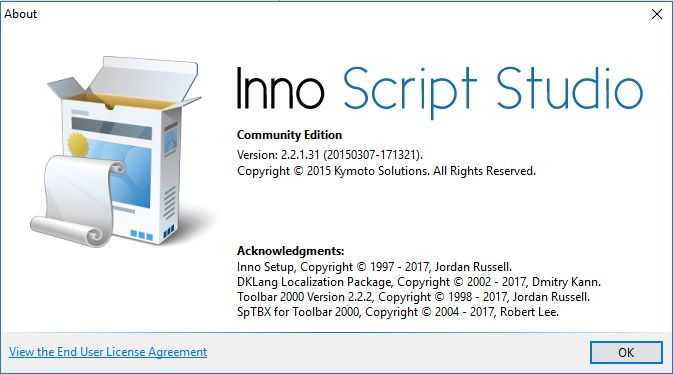

# Build for Windows 7

## Build for Release

Set the project build type to: Release

You can use what ever platform you want here, I have tried them all on Windows 7 and they work just fine: x86, x64 or AnyCpu

Note however that x64 will not work on a Windows 7 machine that is x86!

Right click on the SampleMaps2017App.WPF project and select build.

## Generate an installer for Windows 7 or Windows 10

Using Inno Script Studio:

Inno Script Studio Installer can be found at: [Inno Script Studio](https://www.kymoto.org/products/inno-script-studio)

Open the Script file [SampleMaps2017App.WPF.iss](../SampleMaps2017App/Inno/SampleMaps2017App.WPF.iss) using Inno Script Studio

Then in Inno Script Studio select the Compile button.

Copy the output file generated by Inno Script Studio which should be called: 

    C:\SharedProjects\vs2017\XamarinWPFSamples\SampleMaps2017App\Installer\WPFv010000\SampleMaps2017AppWPF010000Setup.exe

to your Windows 7 machine, and run that file.  Make sure your virus protector is temporarily shut off.  Windows 7 Virus Protectors like Avast do not like Inno Compiled Files.  WebRoot does not need to be temporarily shut off.

## Authors

John Russell - Senior Software Engineer II - Indigo Olive Software, Inc.

