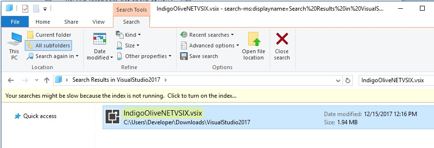
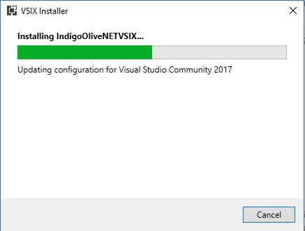
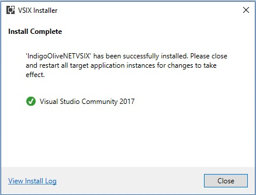
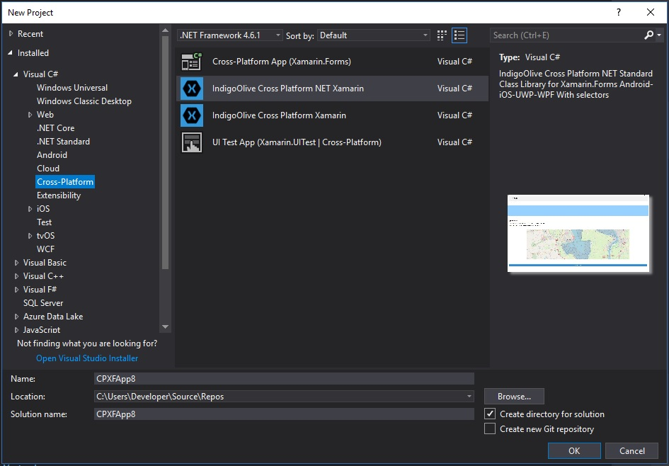
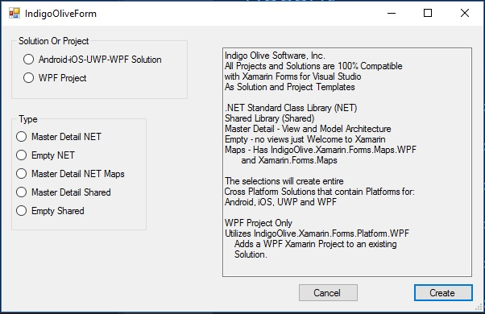
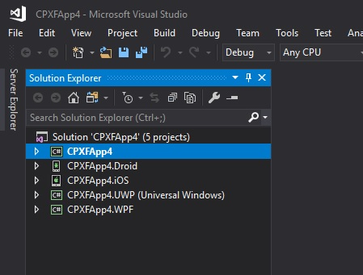

# XamarinWPFSamples

The samples in this repository demonstrate how to use the Visual Studio NuGet Package IndigoOlive.Xamarin.Forms.Platform.WPF and the NuGet Package IndigoOlive.Xamarin.Forms.Maps.WPF.

The simplest and fastest way to get going is to download the IndigoOliveNETVSIX.vsix located in the Template directory of this Repository.

## Using IndigoOliveNETVSIX.vsix

Download the file to your computer.

Make sure Microsoft Visual Studio 2017 is not running any instances.

Double-Click on the file in Windows Explorer:



The Visual Studio VSIX Installer will open:



And when it is finished:



Now open Visual Studio back up.

Select create new project.

Under C# and Cross-Platform you will see:



Make your desired selections as shown:



Press create, and your project is created:



## Add the Registration Code

Go to http://wpfnuget.indigoolive.com and register for a login.  Verify your email.  Purchase a license package.  After approved by PayPal, a registration code will be emailed to the email address you used to register a login.

Open App.xaml.cs and change the code from:

```C#
        public App() {
            Xamarin.Forms.Forms.Init("INSERT-LICENSE-HERE");
        }
```

to:

```C#
        public App() {
            Xamarin.Forms.Forms.Init("HG2oNeQtuA1mErizfrOsXkZKcBSBay7WotqvVQ5LQZXwc0kvvT4LzcWtXWLkLWVoK4XVJk6KF13Szd+gTDhX/Y5B3hnz94BVA=K6MkhzzPR0on/eA26AKhq/+D7iW7qEETBzU/BnttNI=bHujYw0kkrWK1MaEQ69LQ==");
        }
```

## Android notes

For tips on using with Android see [AndroidReadMe.md](AndroidReadMe.md)

## Install on Windows 7

For instructions on how to install on Windows 7 see [Documentation/Windows7ReadMe.md](Documentation/Windows7ReadMe.md)

## Authors

John Russell - Senior Software Engineer II - Indigo Olive Software, Inc.

## License

These samples and all attached documents are free to use, copy, and sell.

