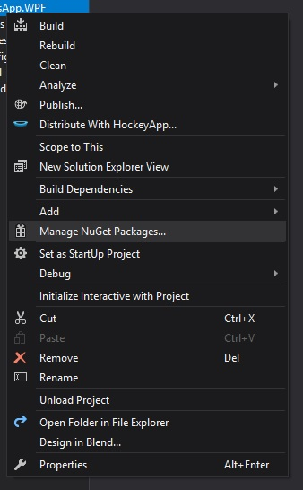
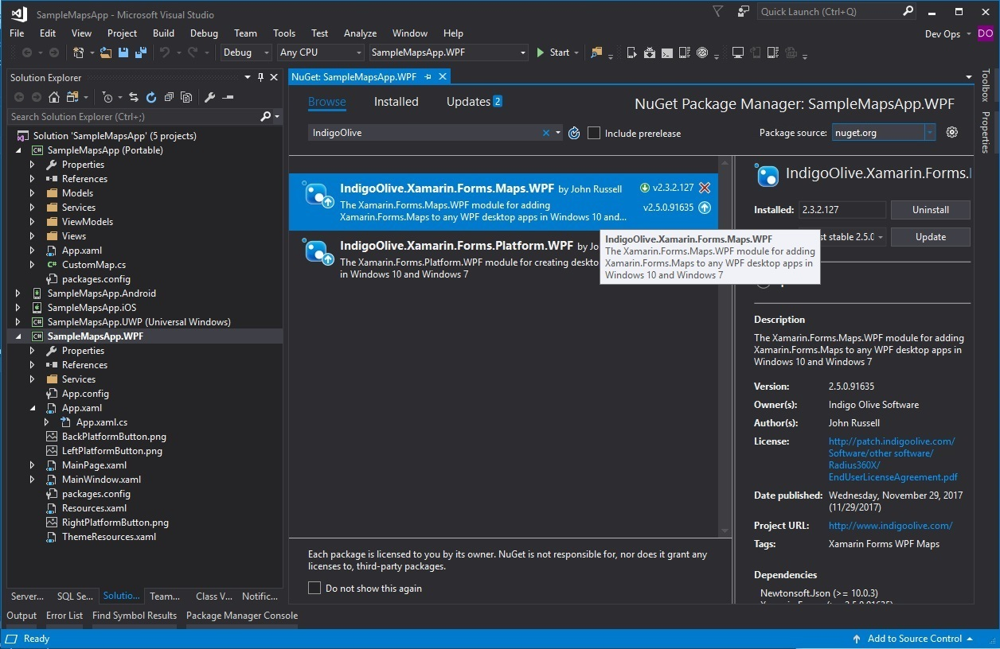

# XamarinWPFSamples

The samples in this repository demonstrate how to use the Visual Studio NuGet Package IndigoOlive.Xamarin.Forms.Platform.WPF and the NuGet Package IndigoOlive.Xamarin.Forms.Maps.WPF.

If you are a seasoned developer, the you only need to make sure that the secions below titled: "Modify App.xaml", "Modify App.xaml.cs" and "Add CustomMapRenderer" are completed.  The rest of this should be
second hand, and is just here as a reference.

## Getting Started

### Create the Xamarin.Forms SampleMapsApp

Open Microsoft Visual Studio


Create a new Cross Platform Xamarin App with the name: SampleMapsApp.


Select Master Detail and PCL type project and click Finish.


### Add the WPF project

Add a new project to the solution.


To keep the project structure, browse for project location.

If your project is located at C:\MyProjects\SampleMapsApp, the structure will look like:

    C:\MyProjects\SampleMapsApp
    C:\MyProjects\SampleMapsApp\.vs
    C:\MyProjects\SampleMapsApp\packages
    C:\MyProjects\SampleMapsApp\SampleMapsApp
    C:\MyProjects\SampleMapsApp\SampleMapsApp\SampleMapsApp
    C:\MyProjects\SampleMapsApp\SampleMapsApp\SampleMapsApp.Android
    C:\MyProjects\SampleMapsApp\SampleMapsApp\SampleMapsApp.iOS
    C:\MyProjects\SampleMapsApp\SampleMapsApp\SampleMapsApp.UWP
    C:\MyProjects\SampleMapsApp.sln

So, browse to the C:\MyProjects\SampleMapsApp\SampleMapsApp


Now select C#

Select the Windows Classic Desktop -> WPF App (.NET Framework)


Give the project the name: SampleMapsApp.WPF

Finally press Ok.

### Add the Xamarin.Forms.Platform.WPF Nuget to the WPF Application

Right click the SampleMapsApp.WPF project.

Select Manage Nuget Packages



Browse and Install Xamarin.Forms.Platform.WPF by John Russell



Accept the license agreement.

### Modify App.xaml

Open file new project file: App.Xaml

change the code from:

```xml
    <Application x:Class="SampleCarouselApp.WPF.App"
                 xmlns="http://schemas.microsoft.com/winfx/2006/xaml/presentation"
                 xmlns:x="http://schemas.microsoft.com/winfx/2006/xaml"
                 xmlns:local="clr-namespace:SampleCarouselApp.WPF"
                 StartupUri="MainWindow.xaml">
        <Application.Resources>
         
        </Application.Resources>
    </Application>
```

to:

```xml
    <Application x:Class="SampleMapsApp.WPF.App"
                 xmlns="http://schemas.microsoft.com/winfx/2006/xaml/presentation"
                 xmlns:x="http://schemas.microsoft.com/winfx/2006/xaml"
                 xmlns:local="clr-namespace:SampleMapsApp.WPF"
                 StartupUri="MainPage.xaml">
        <Application.Resources>
            <ResourceDictionary Source="Resources.xaml" />
        </Application.Resources>
    </Application>
```

What was changed?

MainWindow.xaml was changed to MainPage.xaml

Added the line <ResourceDictionary Source="Resources.xaml" />

### Modify App.xaml.cs

Open file new project file: App.Xaml.cs

change the code from:

```C#
	using System;
	using System.Collections.Generic;
	using System.Configuration;
	using System.Data;
	using System.Linq;
	using System.Threading.Tasks;
	using System.Windows;

	namespace SampleCarouselApp.WPF
	{
		/// <summary>
		/// Interaction logic for App.xaml
		/// </summary>
		public partial class App : Application
		{
		}
	}
```

to:

```C#
	using System;
	using System.Collections.Generic;
	using System.Configuration;
	using System.Data;
	using System.Linq;
	using System.Threading.Tasks;
	using System.Windows;

	using Xamarin.Forms;
	using Xamarin.Forms.Platform.WPF;

	namespace SampleCarouselApp.WPF
	{
		/// <summary>
		/// Interaction logic for App.xaml
		/// </summary>
		public partial class App : System.Windows.Application
		{
			/// <summary>
			/// Initializes the singleton application object.  This is the first line of authored code
			/// executed, and as such is the logical equivalent of main() or WinMain().
			/// </summary>
			public App() {
				Xamarin.Forms.Forms.Init("INSERT-LICENSE-HERE");
			}
		}
	}
```

What was changed?

Application was changed to System.Windows.Application

and public App() {} constructor was added.

which also included the contents of the constructor: Xamarin.Forms.Forms.Init("INSERT-LICENSE-HERE");

### Add the Registration Code

Go to http://wpfnuget.indigoolive.com and register for a login.  Verify your email.  Purchase a license package.  After approved by PayPal, a registration code will be emailed to the email address you used to register a login.

Open App.xaml.cs and change the code from:

```C#
        public App() {
            Xamarin.Forms.Forms.Init("INSERT-LICENSE-HERE");
        }
```

to:

```C#
        public App() {
            Xamarin.Forms.Forms.Init("HG2oNeQtuA1mErizfrOsXkZKcBSBay7WotqvVQ5LQZXwc0kvvT4LzcWtXWLkLWVoK4XVJk6KF13Szd+gTDhX/Y5B3hnz94BVA=K6MkhzzPR0on/eA26AKhq/+D7iW7qEETBzU/BnttNI=bHujYw0kkrWK1MaEQ69LQ==");
        }
```
    
### Add a reference

In the SampleMapsApp.WPF right click onto References and select Add...


Then add a reference to the Project in the solution called: SampleApp


### Set as startup project

Set the SampleMapsApp.WPF as the Start-Up Project for the SampleMapsApp Solution.

### Add CustomMapRenderer

Create an new class called: CustomMapRenderer

Add the following code to that file:

```C#
    using System;
    using System.Collections.Generic;
    using System.Linq;
    using System.Text;
    using System.Threading.Tasks;

    using System.Globalization;
    using System.Collections.ObjectModel;
    using System.Windows;
    using System.Windows.Input;
    using MapControl;

    using Xamarin.Forms;
    using Xamarin.Forms.Platform.WPF;
    using Xamarin.Forms.Maps;
    using Xamarin.Forms.Maps.WPF;
    using System.ComponentModel;

    using SampleApp;
    using SampleApp.WPF;

    [assembly: ExportRenderer(typeof(CustomMap), typeof(CustomMapRenderer))]
    namespace SampleApp.WPF {
        public class Base : INotifyPropertyChanged
        {
            public event PropertyChangedEventHandler PropertyChanged;

            protected void RaisePropertyChanged(string propertyName)
            {
                PropertyChanged?.Invoke(this, new PropertyChangedEventArgs(propertyName));
            }
        }

        public class Point : Base
        {
            private string name;
            public string Name
            {
                get { return name; }
                set
                {
                    name = value;
                    RaisePropertyChanged("Name");
                }
            }

            private MapControl.Location location;
            public MapControl.Location Location
            {
                get { return location; }
                set
                {
                    location = value;
                    RaisePropertyChanged("Location");
                }
            }
        }
    
        public class CustomMapRenderer : MapRenderer
        {
            MapControl.Map nativeMap;
            List<CustomPin> customPins;

            protected override void OnElementChanged(ElementChangedEventArgs<Xamarin.Forms.Maps.Map> e)
            {
                base.OnElementChanged(e);

                if (e.OldElement != null)
                {
                    nativeMap = null;
                }

                if (e.NewElement != null)
                {
                    var formsMap = (CustomMap)e.NewElement;
                    this.nativeMap = Control as MapControl.Map;
                    this.customPins = formsMap.CustomPins;

                    updateAllPins();
                }
            }

            private void updateAllPins() {
                if (this.customPins != null) {
                    int nOdx = 0;
                    int nCount = 0;

                    nCount = this.customPins.Count;
                    for (nOdx = 0; nOdx < nCount; nOdx++) {
                        string sPinLabel = this.customPins[nOdx].Latitude.ToString("F2").Substring(0, 2);
                        MapControl.Location aLoc = new MapControl.Location(this.customPins[nOdx].Latitude, this.customPins[nOdx].Longitude);
                        System.Windows.Media.Brush pinBrush = System.Windows.Media.Brushes.Blue;
                        if (this.customPins[nOdx].BluePin) {
                            pinBrush = System.Windows.Media.Brushes.Blue;
                        } else {
                            /** Orange Push Pin */
                            pinBrush = System.Windows.Media.Brushes.Orange;
                        }

                        ObservableCollection<Point> somePushpins = new ObservableCollection<Point>();

                        /**
                         * From Xaml Map Control github code (codeplex)
                         *  Pushpins = new ObservableCollection<Point>();
                            Pushpins.Add(
                                new Point
                                {
                                    Name = "WHV - Eckwarderhörne",
                                    Location = new Location(53.5495, 8.1877)
                                });
                         **/

                        Point aPushPin = new Point {
                            Name = sPinLabel,
                            Location = new MapControl.Location(aLoc.Latitude, aLoc.Longitude)
                        };

                        System.Windows.Style style = new System.Windows.Style {TargetType = typeof(MapItem) };
                        style.Setters.Add(new System.Windows.Setter( MapPanel.LocationProperty, aLoc));
                        style.Setters.Add(new System.Windows.Setter( MapItem.VerticalContentAlignmentProperty, System.Windows.VerticalAlignment.Bottom ));
                        style.Setters.Add(new System.Windows.Setter( MapItem.ForegroundProperty, System.Windows.Media.Brushes.Black));
                        style.Setters.Add(new System.Windows.Setter( MapItem.BackgroundProperty, pinBrush));
                        style.Setters.Add(new System.Windows.Setter( MapItem.VisibilityProperty, System.Windows.Visibility.Visible));
                        System.Windows.FrameworkElementFactory aPin = new FrameworkElementFactory(typeof(MapControl.Pushpin));
                        aPin.SetValue(MapControl.Pushpin.ContentProperty, sPinLabel);
                        aPin.SetValue(MapControl.Pushpin.ForegroundProperty, System.Windows.Media.Brushes.Black);
                        aPin.SetValue(MapControl.Pushpin.BackgroundProperty, pinBrush);
                        System.Windows.Controls.ControlTemplate ct = new System.Windows.Controls.ControlTemplate(typeof(MapControl.MapItem));
                        ct.VisualTree = aPin;
                        style.Setters.Add(new System.Windows.Setter( MapItem.TemplateProperty, ct));

                        somePushpins.Add(aPushPin);

                        MapControl.MapItemsControl aControl = new MapItemsControl {
                            ItemsSource = somePushpins,
                            ItemContainerStyle = style,
                            IsSynchronizedWithCurrentItem = true
                        };

                        Control.Children.Add(aControl);
                    }
                }
            }

            protected override void OnElementPropertyChanged(object sender, PropertyChangedEventArgs e) {
                base.OnElementPropertyChanged(sender, e);

                if (e.PropertyName.CompareTo("UpdateAllPins") == 0) {
                    this.customPins = ((CustomMap)this.Element).CustomPins;
                    updateAllPins();
                } else if (e.PropertyName.CompareTo("ClearAllPins") == 0) {
                    this.customPins.Clear();
                }
            }
        }
    }
```

### Add Xamarin.Forms.Maps.WPF

To enable the Maps capability with Xamarin.Forms.Platform.WPF you must also add
the Xamarin.Forms.Maps.WPF by John Russell


## Build

Right click on the SampleMapsApp.WPF project and select build.

## Run

At the top of the Visual Studio screen, select "Start >"

## Authors

John Russell - Senior Software Engineer II - Indigo Olive Software, Inc.

## License

These samples and all attached documents are free to use, copy, and sell.
