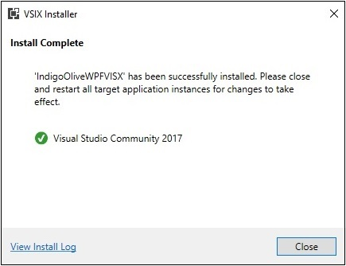

# XamarinWPFSamples

The samples in this repository demonstrate how to use the Visual Studio NuGet Package IndigoOlive.Xamarin.Forms.Platform.WPF and the NuGet Package IndigoOlive.Xamarin.Forms.Maps.WPF.

For tips on using with Android see [AndroidReadMe.md](AndroidReadMe.md)

The simplest and fastest way to get going is to download the IndigoOliveWPFVSIX.vsix located in the Template directory of this Repository.

## Using IndigoOliveWPFVSIX.vsix

Download the file to your computer.

Make sure Microsoft Visual Studio 2017 is not running any instances.

Double-Click on the file in Windows Explorer:

The Visual Studio VSIX Installer will open:

And when it is finished:

Now open Visual Studio back up.

Select create new project.

Under C# and Cross-Platform you will see:

Make your desired selections as shown:

Press create, and your project is created:

